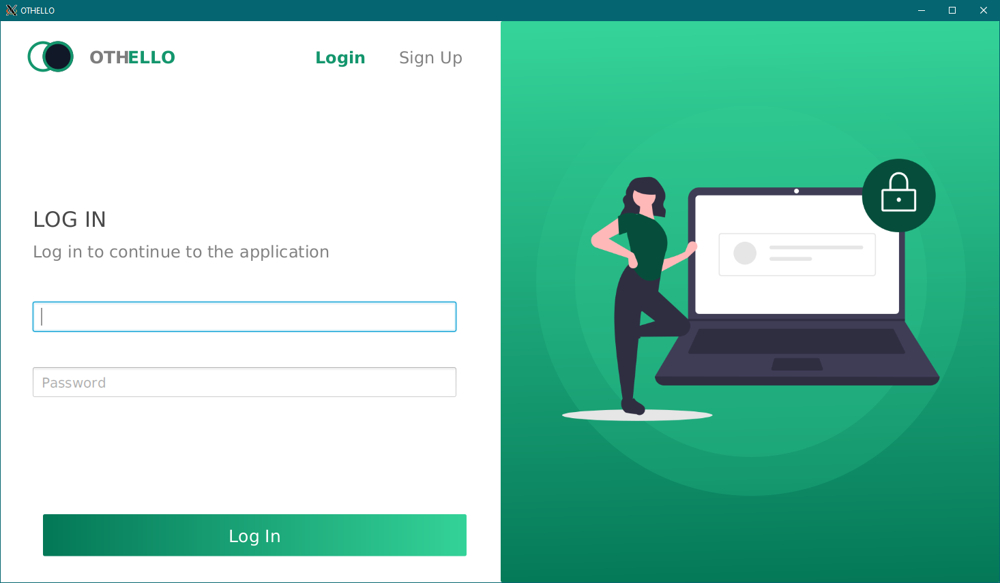
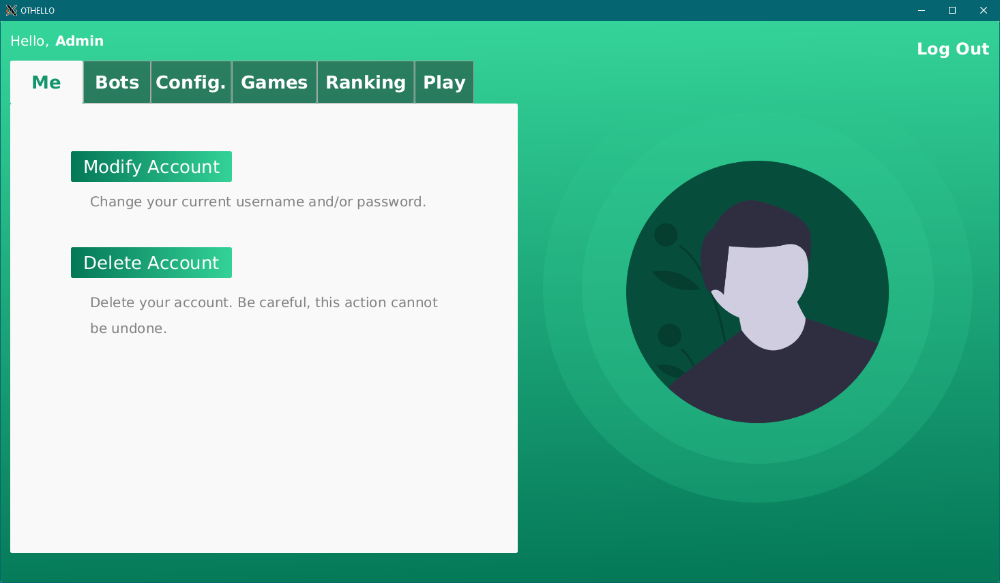
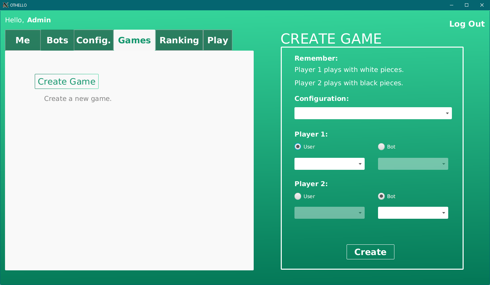
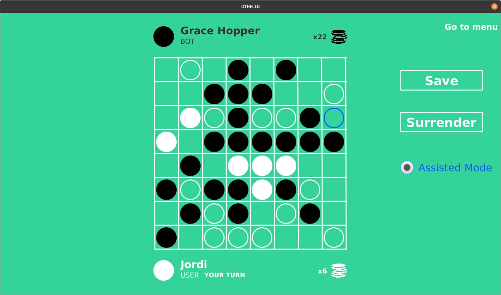

# `Othello`

**`PROP-FIB desktop application project`**

# Screenshots

### Login



### Menu



### Game Creator



### Playing Board



# Credits

- [**`Alex Rodriguez`**](https://github.com/neoxelox)
- [**`Manuel Navid`**](https://github.com/LearningBizz)
- [**`Arnau Pujantell`**](https://github.com/LearningBizz)
- [**`Roger Mollon`**](https://github.com/rogermollon)

# Setup

- Install Java SDK 11: **`sudo apt-get install default-jdk`**
- Install Doxygen: **`sudo apt-get install doxygen graphviz`**

# Executing

Run **`make help`** to get a list of all available commands.

# Documentation

There is full-code documentation generated by Doxygen in HTML and PDF formats in the [**`Documentation`**](doc) folder.

# Directory structure

```
.
├── doc
├── lib
│   ├── Linux
│   ├── MacOS
│   └── Windows
├── res
│   ├── assets
│   │   ├── fonts
│   │   ├── images
│   │   └── sounds
│   ├── databases
│   ├── defaults
│   └── fixtures
│       ├── difficulty
│       ├── isValid
│       ├── loadBoard
│       └── placePiece
│           ├── borders
│           ├── corners
│           ├── eating
│           └── extreme
└── src
    ├── cmd
    │   ├── driver
    │   └── unitary
    ├── domain
    ├── repository
    ├── test
    │   ├── driver
    │   └── unitary
    ├── util
    └── view
        └── template
```
